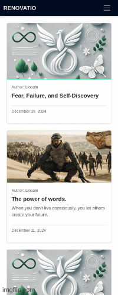

# Welcome to [RENOVATIO](https://renovatio-488178e90e29.herokuapp.com/)


<br>

Curious to see what I have built? Here (https://renovatio-488178e90e29.herokuapp.com/) is deployed link.


## Purpose of the site

This site is a dynamic, blog-style platform designed to guide you through the evolving landscape of personal development. Our mission is to provide you with actionable insights, inspiring stories, and practical tools to empower your journey of renewal, transformation, and continuous growth.

Site owner’s main objectives are:

-   to keep readers informed about the latest trends and breakthroughs in personal growth
-   to offer educational resources that foster self-discovery, resilience, and well-being
-   to spark curiosity and open-minded exploration into various methodologies and philosophies of personal improvement
-   to build a supportive, interactive community where visitors can share experiences, insights, and encouragement
-   to cultivate a space that unites individuals who share a passion for transformation and holistic self-development

Site user’s main objectives are:

-   to stay current with emerging techniques and ideas for personal betterment
-   to connect and engage with like-minded individuals who value self-growth and positive change
-   to participate in meaningful discussions, sharing knowledge, feedback, and personal journeys
-   to learn from a collective pool of experiences, ensuring continuous inspiration and motivation
-   to contribute insights and encourage others, thereby fostering a vibrant, uplifting community of learners and doers

------
## Why This

Personal growth, renewal, and transformation aren’t just passing trends; they reflect our innate human desire to understand ourselves more deeply and become the best versions of who we can be. The world around us—be it in wellness, psychology, career development, or creativity—is constantly evolving, offering new insights, techniques, and perspectives for self-improvement.

I created this project because I genuinely believe in the power of personal transformation. I want more people to recognize that growth is possible for everyone, to become curious about the countless ways we can improve ourselves, and to explore these pathways openly. For those who share the same passion, I hope this site becomes a welcoming space where we exchange stories, insights, and encouragement—learning together, supporting one another, and collectively embracing the ongoing journey of self-discovery and positive change.

------

## Project planning
<br>

### User Stories
The tasks users can perform depends on their role. On this site, there are admin, first time user and returned users, tasks that they have the authorization to perform are shown in below table:


| Role         | Task                                | Related User Stories                       | Completed |
|------------------|-----------------------------------------|-----------------------------------------------|---------------|
| Admin        | Manage Posts                           | Manage blog content                          | Yes           |
|                  | Create draft post                      | Draft post                                    | Yes           |
|                  | Search for a post                      | Search post                                   | Yes           |
|                  | Manage Comments                         | Delete comments                               | Yes           |
|                  | Manage Collaborate Requests             | Approve/Disapprove comments                    | Yes           |
|                  | Publish Post                           | Publish blog post                             | Yes           |
|                  | Edit Post                              | Edit existing blog post                       | Yes           |
|                  | Delete Post                            | Delete blog post                              | Yes           |
|                  | Manage User Accounts                   | Create/Remove User Accounts                   | Yes           |
|                  | Edit User Profiles                     | Edit user profiles                            | Yes           |
|                  | Manage Social Accounts                 | Connect/Disconnect Social Accounts            | Yes           |
|                  | Manage Email Addresses                 | Add/Remove Email Addresses                    | Yes           |
|                  | Update Site Settings                   | Configure site settings                       | Yes           |
|                  | View Site Analytics                    | View site analytics                           | Yes           |
| First Time User | Know which site is for quickly         | Purpose of the site is clear                  | Yes           |
|                  | View posts                              | View multiple posts                           | Yes           |
|                  | Signup for a new account and login     | Signup for new account                        | Yes           |
|                  | Signup/Login with Google account       | Single signup with Google account             | Yes           |
|                  | Add View Comments that are approved    | View comments that are approved               | Yes           |
|                  | Send request to Collaborate            | Send request to Collaborate                    | Yes           |
| Site User    | View likes on posts                    | View likes                                    | Yes           |
|                  | View paginated site                    | Paginated site                                | Yes           |
| Returning User | Comment on posts                       | View comments                                 | Yes           |
|                  | Add, view, update and delete their own Comments | View/edit/delete comments                     | Yes           |
|                  | Send Collaboration Request              | Send Collaboration Request                    | Yes           |
|                  | Like/unlike posts                      | Like/unlike a post                            | Yes           |
|                  | View full posts                        | View full post                                | Yes           |
|                  | Update/delete their own comments       | make/edit/delete comments                     | Yes           |
|                  | Login to my account                    | Login                                         | Yes           |
|                  | Logout of my account                   | Logout from my account                        | Yes           |

<br>

#### **Logic**

Initially, I envision this project as my personal blog, where I am the only one who can create and manage posts through the admin panel. The primary goal is to maintain full control over the content and ensure the quality and relevance of the posts.

For now:

-   Users who sign in can interact with the blog by **commenting** on posts and **liking** them. These interactions allow for engagement without affecting the integrity of the blog content.
-   To maintain a clean and focused space, the ability to create posts is restricted solely to me as the admin.

Future development plan:

-   I plan to introduce a **collaboration feature** where users can request to become bloggers. This will be implemented through a form that users can fill out to express their interest in contributing to the blog.
-   As the admin, I will review these requests and manually approve users I find suitable for collaboration.
-   Approved users will gain the ability to create posts, but all user-generated posts will still require admin approval before being published to ensure content quality, prevent spam, and maintain the blog's overall focus and professionalism.

By implementing this phased approach, I can gradually scale the blog while maintaining its quality and purpose during its early stages.
<br>

### **Database Structure**

Below is the Database structure that this project is based on. There are User, Post and Comment tables, you can also see their relationships between each table.


<br>

### **WireFrames**


<br>


...


<br>

#### **Font**

I decided to use the default font because it provides a simple and clean look. Most importantly, it ensures consistency across different browsers and is easy to read.

<br>


#### **Color**

The color pallette i took inspiration from movie "In Time".
<br>
<details><summary>In Time - 2011</summary>
</details>
<details><summary>Color palette</summary>
</details>

<br>

## **Installations**


Below are the installations we need before writing any code:

<br>

Install the server to use when deploy on Heroku
  ```sh
  pip3 install django gunicorn
  ```

Supporting libraries:
  * Postgresql and psycopg2
  ```sh
  pip3 install dj_database_url psycopg2
  ```
  * to run Cloudinary
  ```sh
  pip3 install dj3-cloudinary-storage
  ```
  Creat file list:
  * create requirement.txt
  ```sh
  pip3 freeze --local > requirements.txt
  ```
  * create new django project
  ```sh
  django-admin startproject funginews .
  ```
  * create blog app
  ```sh
  python3 manage.py startapp blog
  ```


## **Present you blog site**


By clicking [Renovatio](https://renovatio-488178e90e29.herokuapp.com/) first thing you will see is the landing page. Here you can see the navbar on the top which has links for Home,About Signup & Login.

If you scroll down you will see the articles section with the latest posts, along with info like title, author, a short snippet of the post, date and time when the post was created as well as pagination effect to go to next page of posts.

If you are logged in, you will see posts by clicking on any this will take you to the respective page of the post. If you are not logged in you will <b>Not</b> see comment functionality of adding comments and Likes but you can see comments that were approved by admin.

#### **Desktop**

<details><summary>Not logged in user</summary>

</details>

<br>

<details><summary>Logged in user</summary>

</details>

<br>

#### **Notifications**

<details><summary>Some of the main notifications</summary>

</details>

<br>

#### **Mobile**

<details><summary>Not logged in user</summary>

</details>

<br>

<details><summary>Logged in user</summary>

</details>

<br>
The project naturally evolved throughout the development process, leading me to make changes beyond the original wireframes and incorporate features I hadn’t initially planned. Overall, I’m quite satisfied with how it has turned out.


## **Testing & Code Validation**

--->>>


## **Tech Stack**
### **Language**

This project is a Full-Stack site based on business logic used to control a centrally-owned dataset. With the authentication it provide role-based access to the data.

Main programming languages used are:

- **Python**
- **Django**
- **HTML**
- **CSS**
- **Javascript**
- **Postgresql**
- **Psycopg2**

### **Tools**
- [Github](https://github.com/) for store and version control of the code

- [Gitpod](https://gitpod.io/workspaces) for editing code

- [Heroku](https://heroku.com/) for deployment

- [Lucidchart](https://www.lucidchart.com/pages/) for creating database relationship

- [Cloudinary](https://cloudinary.com) for store the images and css files used in this project

- [imgflip](https://imgflip.com/) for creating gif screenshots

- [GitHub Wiki TOC generator](https://ecotrust-canada.github.io/markdown-toc/) for generating table of content for README.md file
