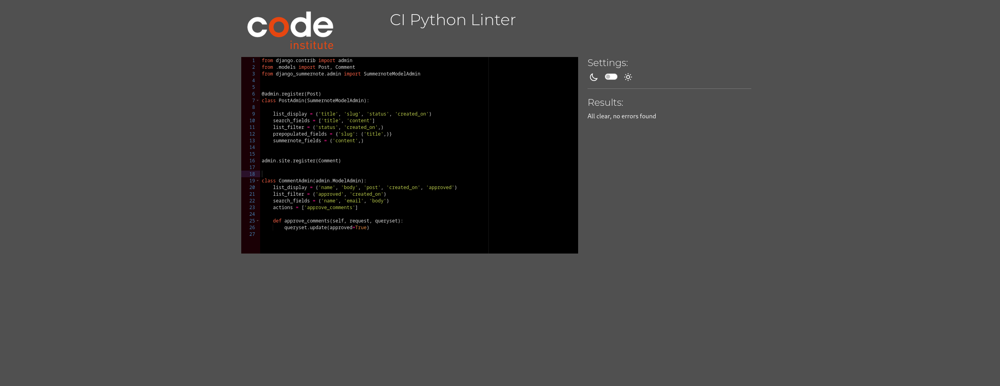

# **Testing**

## **Code Validation**
[Jigsaw CSS validator](https://jigsaw.w3.org/css-validator/) was used to validate CSS code

CSS

CSS warnings

These errors are caused by third-party code (Font Awesome) and do not affect your project’s functionality.

[Nu Html checker](https://validator.nu/) for validate HTML code

HTML

about.html

all_posts.html

signup.html

login.html

logout.html

 

[Pep8ci](https://pep8ci.herokuapp.com/) for validate python code

Pep8ci

 
Pep8 for validate python code

Blog - Settings.py

Blog - apps.py

Blog - forms.py

Blog - models.py

Blog - Admin.py

Blog - views.py

Funginews - asgi.py

